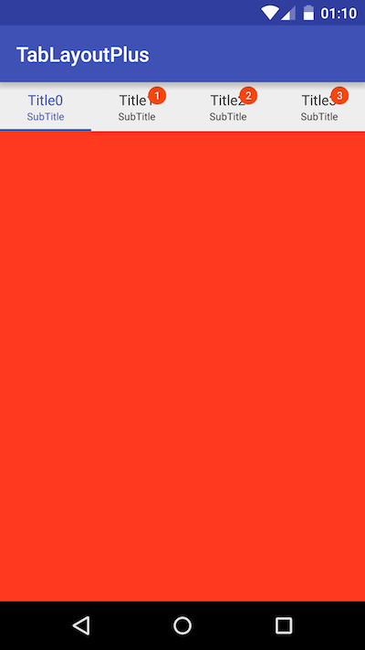
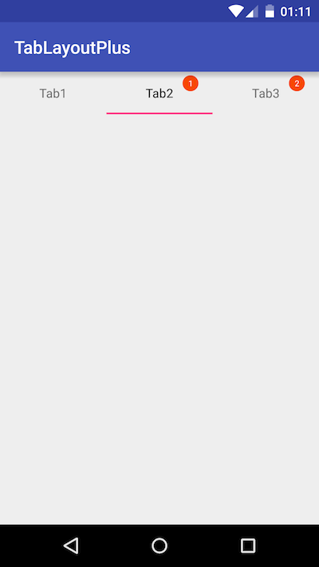
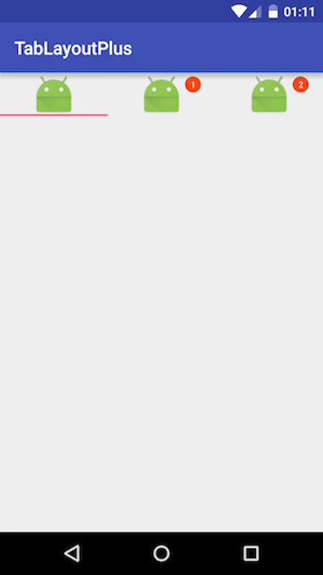

# TabLayoutPlus

---

TabLayout是support:design中提供的一个标签页面组件，这个组件非常好用。但是在项目里面经常有模仿iOS中Tab标签项，有未读消息的选项，那么TabLayoutPlus就是我封装的一个库。


## 效果图







## 使用方法

只需要按照平常那样使用就可以了。

```
    <cn.mycommons.tablayoutplus.library.TabLayoutPlus
        android:id="@+id/tabLayout"
        android:layout_width="match_parent"
        android:layout_height="wrap_content" />
```

与ViewPager集成

```
    viewPager.setAdapter(adapter);
    tabLayout.setupWithViewPager(viewPager);
    tabLayout.setTabMode(TabLayout.MODE_FIXED);

    for (int i = 0; i < adapter.getCount(); i++) {
        BadgedTabCustomView customView = tabLayout.getTabCustomViewAt(i);
        if (customView != null) {
            customView.setTabSubText("SubTitle");
            customView.setTabCount(i);
        }
    }
```

或者是单独使用

```
    tabLayout.addTab(tabLayout.newTabPlus());
    tabLayout.addTab(tabLayout.newTabPlus());
    tabLayout.addTab(tabLayout.newTabPlus());

    for (int i = 0; i < tabLayout.getTabCount(); i++) {
        BadgedTabCustomView customView = tabLayout.getTabCustomViewAt(i);
        if (customView != null) {
            customView.setTabText("Tab" + (i + 1));
            customView.setTabCount(i);
        }
    }
```

也可以不显示文字，只显示图片

```
    tabLayout.addTab(tabLayout.newTabPlus());
    tabLayout.addTab(tabLayout.newTabPlus());
    tabLayout.addTab(tabLayout.newTabPlus());

    for (int i = 0; i < tabLayout.getTabCount(); i++) {
        BadgedTabCustomView customView = tabLayout.getTabCustomViewAt(i);
        if (customView != null) {
            customView.setTabCount(i);
            customView.setTabIcon(R.drawable.ic_launcher);
        }
    }
```